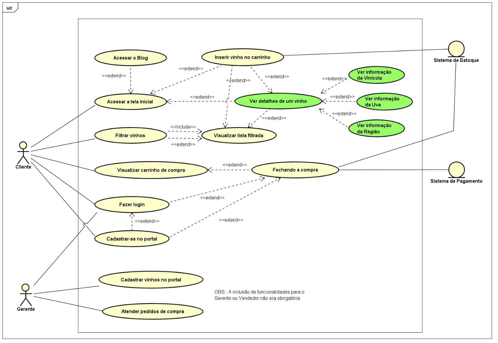

# Checkpoint 5 - Software Design & Total Experience

## Objetivo
Apresentar o protótipo da tela de consulta de detalhes de um vinho, que possibilite ao usuário visualizar e analisar todas as informações relevantes sobre o mesmo.

## Diagrama de Caso de uso
Os casos de uso em destaque (em verde) são nosso foco prioritário da prototipagem.

## Requisitos Funcionais da Página
- [ ] 1. Exibição de imagens do vinho - garrafa inteira, o rótulo frontal e o rótulo traseiro, de modo a permitir a leitura das informações contidas nesses rótulos;
- [X] 2. Exibição de informações básicas - nome do vinho, nome da vinícola, tipo do vinho (tinto, branco, rosé, espumante...), tipo(s) de uva(s), safra, região de origem e preço;
- [X] 3. Exibição de informações técnicas - volume da garrafa, graduação alcoólica, classificação do vinho (seco, semi-seco, suave, doce...), tempo/forma de amadurecimento;
- [X] 4. Exibição de informações sensoriais - visual (cor e intensidade), gustativa (taninos, persistência, acidez...), olfativa (aromas primários, secundários...), recomendações de harmonização, de temperatura de serviço;
- [ ] 5. Exibição de tooltips com notas explicativas sobre as informações do vinho;
- [ ] 6. Exibição de detalhes da vinícola;
- [ ] 7. Exibição da avaliação do vinho por um especialista;
- [X] 8. Exibição de comentários de usuários;
- [ ] 9. Incluir produto no carrinho de compras.

## Requisitos Não Funcionais
- [ ] 1. Projeto de ser desenvolvido em React - Vite;
- [X] 2. Projeto de ser estilizado em Tailwind;

## Referências
 - [Wine Advocate](https://www.robertparker.com/wines/p84ztgGSJRWCujBqf/casillero-del-diablo-leyenda-cabernet-sauvignon-2014)
 - [Wine Searcher](https://www.wine-searcher.com/find/casillero+diablo+leyendas+ltd+edition+cab+sauv+central+valley+chile/2014?srsltid=AfmBOoqKfDX5Xag27qiqYrUlbjv1nfexE4rzJjUnxqo8fAW69uqpxDnZ)

## Integrantes

<a href="https://github.com/MateusLem" target="_blank" style="text-align: center; margin-right: 10px;">

Mateus Leme - RM 557803

